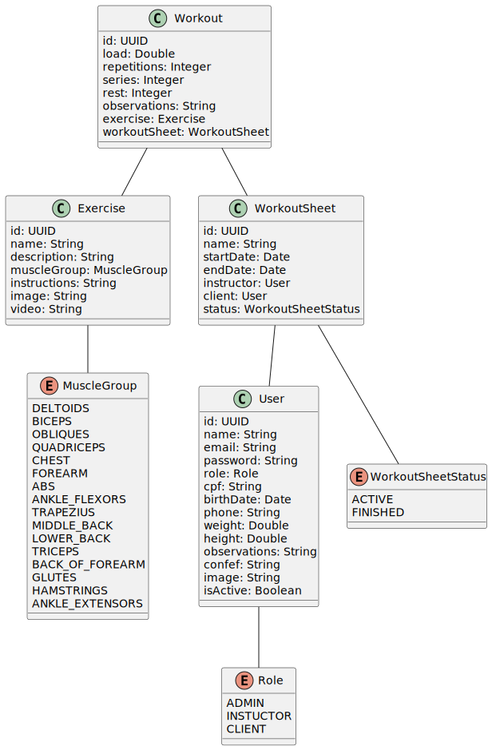

# SmartGym

Aplicação desenvolvida para propositos de estudo, tem o objetivo de gerenciar as fichas de treino de uma academia no estilo SmartFit.

## UML

## Requisitos Funcionais

O sistema possui três atores principais: Aluno, Professor e Administrador.

### Anônimo

- [x] O sistema deve permitir a listagem de todos os grupos musculares
- [x] O sistema deve permitir a listagem de todos os exercícios
- [x] O sistema deve permitir ver as informações de um exercício
- [ ] O sistema deve permitir o login de um usuário

### Administrador

- [ ] O sistema deve permitir a listagem de todos os usuários
- [ ] O sistema deve permitir ver as informações de um usuário
- [ ] O sistema deve permitir o cadastro de alunos
- [ ] O sistema deve permitir revogar o acesso de alunos
- [ ] O sistema deve permitir o cadastro de professores
- [ ] O sistema deve permitir revogar o acesso de professores
- [ ] O sistema deve permitir o cadastro de exercícios
- [ ] O sistema deve permitir a edição de exercícios
- [ ] O sistema deve permitir a exclusão de exercícios

### Professor

- [ ] O sistema deve permitir a listagem de todos os alunos
- [ ] O sistema deve permitir ver as informações de um aluno
- [ ] O sistema deve permitir o cadastro de fichas de treino
- [ ] O sistema deve permitir a edição de fichas de treino
- [ ] O sistema deve permitir a exclusão de fichas de treino
- [ ] O sistema deve permitir a visualização de todas as fichas de treino
- [ ] O sistema deve permitir a visualização de uma ficha de treino de um aluno
- [ ] O sistema deve permitir marcar uma ficha de treino como concluída
- [ ] O sistema deve permitir o cadastro de treinos em uma ficha de treino
- [ ] O sistema deve permitir a edição de treinos em uma ficha de treino
- [ ] O sistema deve permitir a exclusão de treinos em uma ficha de treino
- [ ] O sistema deve permitir a visualização dos treinos de uma ficha de treino

### Aluno

- [ ] O sistema deve permitir a visualização de todas as fichas de treino do aluno logado
- [ ] O sistema deve permitir a visualização de uma ficha de treino do aluno logado
- [ ] O sistema deve permitir a visualização dos treinos de uma ficha de treino do aluno logado
